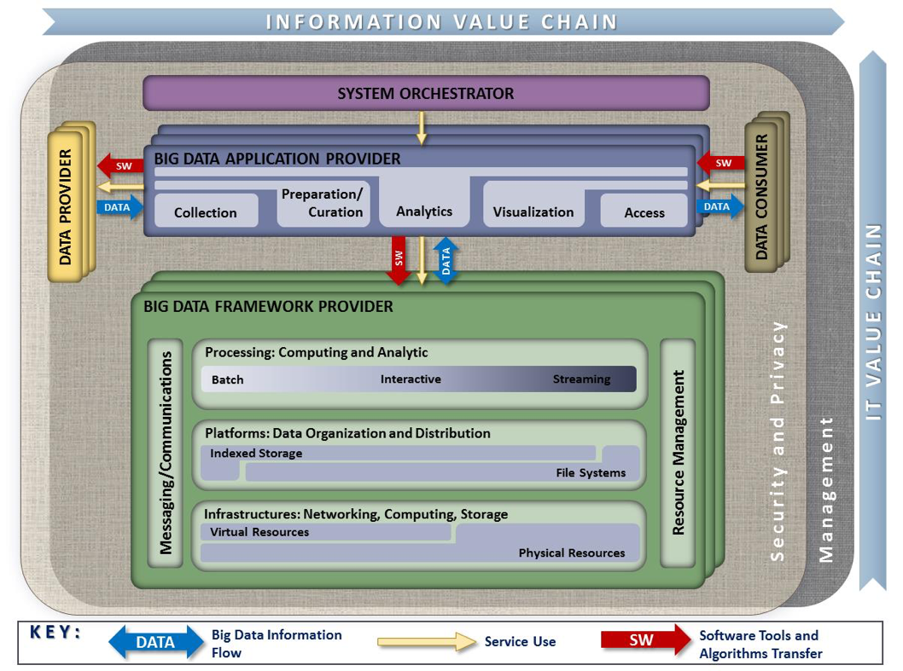
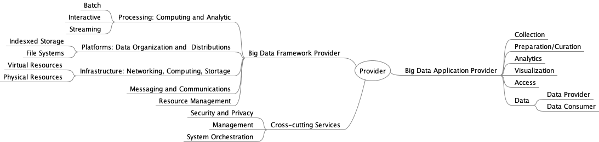
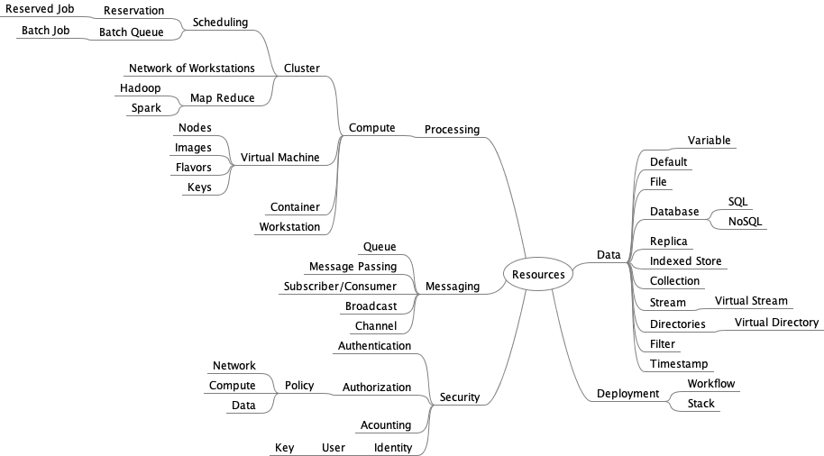

# Abstract

This document summarizes interfaces that are instrumental for the
interaction with Clouds, Containers, and High Performance Computing
(HPC) systems to manage virtual clusters to support the NIST Big Data
Reference Architecture (NBDRA). The REpresentational State Transfer
(REST) paradigm is used to define these interfaces, allowing easy
integration and adoption by a wide variety of frameworks.

Big Data is a term used to describe extensive datasets, primarily in the
characteristics of volume, variety, velocity, and/or variability. While
opportunities exist with Big Data, the data characteristics can
overwhelm traditional technical approaches, and the growth of data is
outpacing scientific and technological advances in data analytics. To
advance progress in Big Data, the NIST Big Data Public Working Group
(NBD-PWG) is working to develop consensus on important fundamental
concepts related to Big Data. The results are reported in the *NIST Big
Data Interoperability Framework (NBDIF)* series of volumes. This volume,
Volume 8, uses the work performed by the NBD-PWG to identify objects
instrumental for the NIST Big Data Reference Architecture (NBDRA) which
is introduced in the NBDIF: Volume 6, *Reference Architecture*.

# Keywords

Adoption; barriers; implementation; interfaces; market maturity;
organizational maturity; project maturity; system modernization.

---

# Acknowledgements

This document reflects the contributions and discussions by the
membership of the NBD-PWG, cochaired by Wo Chang (NIST ITL), Bob
Marcus (ET-Strategies), and Chaitan Baru (San Diego Supercomputer
Center; National Science Foundation). For all versions, the Subgroups
were led by the following people: Nancy Grady (SAIC), Natasha Balac
(SDSC), and Eugene Luster (R2AD) for the Definitions and Taxonomies
Subgroup; Geoffrey Fox (Indiana University) and Tsegereda Beyene
(Cisco Systems) for the Use Cases and Requirements Subgroup; Arnab Roy
(Fujitsu), Mark Underwood (Krypton Brothers; Synchrony Financial), and
Akhil Manchanda (GE) for the Security and Privacy Subgroup; David Boyd
(InCadence Strategic Solutions), Orit Levin (Microsoft), Don Krapohl
(Augmented Intelligence), and James Ketner (AT&T) for the Reference
Architecture Subgroup; and Russell Reinsch (Center for Government
Interoperability), David Boyd (InCadence Strategic Solutions), Carl
Buffington (Vistronix), and Dan McClary (Oracle), for the Standards
Roadmap Subgroup, Gregor von Laszewski (Indiana University) for the
Interface Subgroup.

The following milestone releases exist:

* **Version 2.1**: A previous volume used just the definition of the
  schema based on examples it was easier to read but did only include
  the definition of the resources and not the interaction with the resources.
  This volume was in place till June 2018.
* **Version 2.2**: This version was significantly changed and uses now
  OpenAPI to specify the Interfaces between the various services and components.
  Editors of this volume are:
* **Version 3.1.0**: The version includes the significant improvements
  of the object specifications 

The editors for these documents are:

* Gregor von Laszewski (Indiana University)
* Wo Chang (NIST).

Laurie Aldape (Energetics Incorporated) Elizabeth Lennon (NIST) provided editorial assistance across all NBDIF volumes.


NIST SP 1500-9, Draft NIST Big Data Interoperability Framework: Volume
8, Reference Architecture Interfaces, Version 2 has been
collaboratively authored by the NBD-PWG. As of the date of
publication, there are over six hundred NBD-PWG participants from
industry, academia, and government. Federal agency participants
include the National Archives and Records Administration (NARA),
National Aeronautics and Space Administration (NASA), National Science
Foundation (NSF), and the U.S.  Departments of Agriculture, Commerce,
Defense, Energy, Census, Health and Human Services, Homeland Security,
Transportation, Treasury, and Veterans Affairs.

NIST would like to acknowledge the specific contributions to this
volume, during Version 1 and/or Version 2 activities. *Contributors*
are members of the NIST Big Data Public Working Group who dedicated
great effort to prepare and gave substantial time on a regular basis
to research and development in support of this document. This includes
especially the following NBD-PWG members:


* Gregor von Laszewski, Indiana University
* Wo Chang, National Institute of Standard and Technology,
* Fugang Wang, Indiana University
* Geoffrey C. Fox, Indiana University
* Alicia Zuniga-Alvarado, Consultant
* Robert C. Whetsel, DISA/NBIS
* Pratik Thakkar, Philips


---


# Executive Summary


The *NIST Big Data Interoperability Framework (NBDIF): Volume 8,
Reference Architecture Interfaces* document was prepared by the NIST
Big Data Public Working Group (NBD-PWG) Interface Subgroup to identify
interfaces in support of the NIST Big Data Reference Architecture
(NBDRA) The interfaces contain two different aspects:

* The definition of resources that are part of the NBDRA. These
  resources are formulated in JSON format and can be integrated into a
  REST framework or an object-based framework easily.
* The definition of simple interface use cases that allow us to
  illustrate the usefulness of the resources defined.

The resources were categorized in groups that are identified by the
NBDRA set forward in the *NBDIF: Volume 6, Reference Architecture*
document. While the *NBDIF: Volume 3, Use Cases and General
Requirements* document provides *application-*oriented high-level use
cases, the use cases defined in this document are subsets of them and
focus on *interface* use cases. The interface use cases are not meant to
be complete examples, but showcase why the resource has been defined.
Hence, the interfaces use cases are only representative, and do not
represent the entire spectrum of Big Data usage. All the interfaces were
openly discussed in the working group. Additions are welcome and we like
to discuss your contributions in the group.

The NIST Big Data Interoperability Framework consists of nine volumes,
each of which addresses a specific key topic, resulting from the work of
the NBD-PWG. The nine volumes are:

* Volume 1: Definitions
* Volume 2: Taxonomies
* Volume 3: Use Cases and General Requirements
* Volume 4: Security and Privacy
* Volume 5: Architectures White Paper Survey
* Volume 6: Reference Architecture
* Volume 7: Standards Roadmap
* Volume 8: Reference Architecture Interfaces
* Volume 9: Adoption and Modernization

The NBDIF will be released in three versions, which correspond to the
three development stages of the NBD-PWG work. The three stages aim to
achieve the following with respect to the NBDRA.

1. Identify the high-level Big Data reference architecture key components, which
   are technology-, infrastructure-, and vendor-agnostic.
2. Define general interfaces between the NBDRA components.
3. Validate the NBDRA by building Big Data general applications through
   the general interfaces.

This document is targeting Stage 2 of the NBDRA. Coordination of the
group is conducted on the NBD-PWG web page
(<https://bigdatawg.nist.gov>).

# Introduction {#sec:introduction}

## Background

There is broad agreement among commercial, academic, and government
leaders about the remarkable potential of Big Data to spark innovation,
fuel commerce, and drive progress. Big Data is the common term used to
describe the deluge of data in today's networked, digitized,
sensor-laden, and information-driven world. The availability of vast
data resources carries the potential to answer questions previously out
of reach, including the following:

* How can a potential pandemic reliably be detected early enough to
  intervene?
* Can new materials with advanced properties be predicted before these
  materials have ever been synthesized?
* How can the current advantage of the attacker over the defender in
  guarding against cybersecurity threats be reversed?

There is also broad agreement on the ability of Big Data to overwhelm
traditional approaches. The growth rates for data volumes, speeds, and
complexity are outpacing scientific and technological advances in data
analytics, management, transport, and data user spheres.

Despite widespread agreement on the inherent opportunities and current
limitations of Big Data, a lack of consensus on some important
fundamental questions continues to confuse potential users and stymie
progress. These questions include the following:

* How is Big Data defined?
* What attributes define Big Data solutions?
* What is new in Big Data?
* What is the difference between Big Data and *bigger data* that has
  been collected for years?
* How is Big Data different from traditional data environments and
  related applications?
* What are the essential characteristics of Big Data environments?
* How do these environments integrate with currently deployed
  architectures?
* What are the central scientific, technological, and standardization
  challenges that need to be addressed to accelerate the deployment of
  robust, secure Big Data solutions?

Within this context, on March 29, 2012, the White House announced the
Big Data Research and Development Initiative (The White House Office
of Science and Technology Policy, "Big Data is a Big Deal," *OSTP
Blog*, accessed February 21, 2014,
<http://www.whitehouse.gov/blog/2012/03/29/big-data-big-deal>).  The
initiative's goals include helping to accelerate the pace of discovery
in science and engineering, strengthening national security, and
transforming teaching and learning by improving analysts' ability to
extract knowledge and insights from large and complex collections of
digital data.

Six federal departments and their agencies announced more than \$200
million in commitments spread across more than 80 projects, which aim to
significantly improve the tools and techniques needed to access,
organize, and draw conclusions from huge volumes of digital data. The
initiative also challenged industry, research universities, and
nonprofits to join with the federal government to make the most of the
opportunities created by Big Data.

Motivated by the White House initiative and public suggestions, the
National Institute of Standards and Technology (NIST) accepted the
challenge to stimulate collaboration among industry professionals to
further the secure and effective adoption of Big Data. As a result of
NIST's Cloud and Big Data Forum held on January 15--17, 2013, there was
strong encouragement for NIST to create a public working group for the
development of a Big Data Standards Roadmap. Forum participants noted
that this roadmap should define and prioritize Big Data requirements,
including interoperability, portability, reusability, extensibility,
data usage, analytics, and technology infrastructure. In doing so, the
roadmap would accelerate the adoption of the most secure and effective
Big Data techniques and technology.

On June 19, 2013, the NIST Big Data Public Working Group (NBD-PWG) was
launched with extensive participation by industry, academia, and
government from across the nation. The scope of the NBD-PWG involves
forming a community of interests from all sectors---including industry,
academia, and government---with the goal of developing consensus on
definitions, taxonomies, secure reference architectures, security and
privacy, and, from these, a standards roadmap. Such a consensus would
create a vendor-neutral, technology- and infrastructure-independent
framework that would enable Big Data stakeholders to identify and use
the best analytics tools for their processing and visualization
requirements on the most suitable computing platform and cluster, while
also allowing added value from Big Data service providers.

The *NIST Big Data Interoperability Framework* (NBDIF) will be released
in three versions, which correspond to the three stages of the NBD-PWG
work. The three stages aim to achieve the following with respect to the
NIST Big Data Reference Architecture (NBDRA).

1. Identify the high-level Big Data reference architecture key
   components, which are technology, infrastructure, and vendor agnostic.
2. Define general interfaces between the NBDRA components.
3. Validate the NBDRA by building Big Data general applications through
   the general interfaces.

On September 16, 2015, seven NBDIF Version 1 volumes were published
(<http://bigdatawg.nist.gov/V1_output_docs.php>), each of which
addresses a specific key topic, resulting from the work of the NBD-PWG.
The seven volumes are as follows:

* Volume 1, Definitions
* Volume 2, Taxonomies
* Volume 3, Use Cases and General Requirements
* Volume 4, Security and Privacy
* Volume 5, Architectures White Paper Survey
* Volume 6, Reference Architecture
* Volume 7, Standards Roadmap

Currently, the NBD-PWG is working on Stage 2 with the goals to enhance
the Version 1 content, define general interfaces between the NBDRA
components by aggregating low-level interactions into high-level general
interfaces, and demonstrate how the NBDRA can be used. As a result of
the Stage 2 work, the following two additional NBDIF volumes have been
developed.

* Volume 8, Reference Architecture Interfaces
* Volume 9, Adoption and Modernization

Version 2 of the NBDIF volumes, resulting from Stage 2 work, can be
downloaded from the NBD-PWG website
(<https://bigdatawg.nist.gov/V2_output_docs.php>). The current effort documented in this volume
reflects concepts developed within the rapidly evolving field of Big
Data.

## Scope and Objectives of the Reference Architectures Subgroup

Reference architectures provide "an authoritative source of information
about a specific subject area that guides and constrains the
instantiations of multiple architectures and solutions." Reference
architectures generally serve as a foundation for solution architectures
and may also be used for comparison and alignment of instantiations of
architectures and solutions.

The goal of the NBD-PWG Reference Architecture Subgroup is to develop an
open reference architecture for Big Data that achieves the following
objectives:

* Provides a common language for the various stakeholders;
* Encourages adherence to common standards, specifications, and
  patterns;
* Provides consistent methods for implementation of technology to
  solve similar problem sets;
* Illustrates and improves understanding of the various Big Data
  components, processes, and systems, in the context of a vendor- and
  technology-agnostic Big Data conceptual model;
* Provides a technical reference for U.S. government departments,
  agencies, and other consumers to understand, discuss, categorize,
  and compare Big Data solutions; and
* Facilitates analysis of candidate standards for interoperability,
  portability, reusability, and extendibility.

The NBDRA is a high-level conceptual model crafted to serve as a tool to
facilitate open discussion of the requirements, design structures, and
operations inherent in Big Data. The NBDRA is intended to facilitate the
understanding of the operational intricacies in Big Data. It does not
represent the system architecture of a specific Big Data system, but
rather is a tool for describing, discussing, and developing
system-specific architectures using a common framework of reference. The
model is not tied to any specific vendor products, services, or
reference implementation, nor does it define prescriptive solutions that
inhibit innovation.

The NBDRA does not address the following:

* Detailed specifications for any organization's operational systems;
* Detailed specifications of information exchanges or services; and
* Recommendations or standards for integration of infrastructure
  products.

The goals of the Subgroup will be realized throughout the three planned
phases of the NBD-PWG work, as outlined in @sec:production.

## Report Production {#sec:production}


The *NBDIF: Volume 8,* *References Architecture Interfaces* is one of
nine volumes, whose overall aims are to define and prioritize Big Data
requirements, including interoperability, portability, reusability,
extensibility, data usage, analytic techniques, and technology
infrastructure to support secure and effective adoption of Big Data. The
overall goals of this volume are to define and specify interfaces to
implement the Big Data Reference Architecture. This volume arose from
discussions during the weekly NBD-PWG conference calls. Topics included
in this volume began to take form in Phase 2 of the NBD-PWG work. This
volume represents the groundwork for additional content planned for
Phase 3. During the discussions, the NBD-PWG identified the need to
specify a variety of interfaces.

To enable interoperability between the NBDRA components, a list of
well-defined NBDRA interfaces is needed. These interfaces are documented
in this volume. To introduce them, the NBDRA structure will be followed,
focusing on interfaces that allow bootstrapping of the NBDRA. The
document begins with a summary of requirements that will be integrated
into our specifications. Subsequently, each section will introduce a
number of objects that build the core of the interface addressing a
specific aspect of the NBDRA. A selected number of *interface use cases*
will be showcased to outline how the specific interface can be used in a
reference implementation of the NBDRA. Validation of this approach can
be achieved while applying it to the application use cases that have
been gathered in the *NBDIF: Volume 3, Use Cases and Requirements*
document. These application use cases have considerably contributed
towards the design of the NBDRA. Hence the expectation is that: (1) the
interfaces can be used to help implement a Big Data architecture for a
specific use case; and (2) the proper implementation. This approach can
facilitate subsequent analysis and comparison of the use cases.

This document is expected to grow with the help of contributions from
the community to achieve a comprehensive set of interfaces that will be
usable for the implementation of Big Data Architectures. To achieve
technical and high-quality document content, this document will go
through a public comment period along with NIST internal review.

Report Structure
----------------

The organization of this document roughly corresponds to the process
used by the NBD-PWG to develop the interfaces. Following the
introductory material presented in @sec:introduction, the remainder of this
document is organized as follows:

* @sec:interface-requirements presents the interface requirements;
* @sec:spec-paradigm presents the specification paradign the we use;
* @sec:specification presents several objects grouped by functional
  use while providing a summary table of selected proposed objects in
  @sec:spec-table.


Future Work on this Volume
--------------------------

A number of topics have not been discussed and clarified sufficiently to
be included in Version 2.2. Future topics will be identified during
discussions within the Reference Architecture Subgroup.

# NBDRA Interface Requirements {#sec:interface-requirements}


The development of a Big Data reference architecture requires a thorough
understanding of current techniques, issues, and concerns. To this end,
the NBD-PWG collected use cases to gain an understanding of current
applications of Big Data, conducted a survey of reference architectures
to understand commonalities within Big Data architectures in use,
developed a taxonomy to understand and organize the information
collected, and reviewed existing technologies and trends relevant to Big
Data. The results of these NBD-PWG activities were used in the
development of the NBDRA (@fig:arch) and the interfaces presented herein.
Detailed descriptions of these activities can be found in the other
volumes of the *NBDIF*.

{#fig:arch}


This vendor-neutral, technology- and infrastructure-agnostic conceptual
model, the NBDRA, is shown in @fig:arch and represents a Big Data system
composed of five logical functional components connected by
interoperability interfaces (i.e., services). Two fabrics envelop the
components, representing the interwoven nature of management and
security and privacy with all five of the components. These two fabrics
provide services and functionality to the five main roles in the areas
specific to Big Data and are crucial to any Big Data solution. Note:
None of the terminology or diagrams in these documents is intended to be
normative or to imply any business or deployment model. The terms
*provider* and *consumer* as used are descriptive of general roles and
are meant to be informative in nature.

The NBDRA is organized around five major roles and multiple sub-roles
aligned along two axes representing the two Big Data value chains: the
Information Value (horizontal axis) and the Information Technology (IT;
vertical axis). Along the Information Value axis, the value is created
by data collection, integration, analysis, and applying the results
following the value chain. Along the IT axis, the value is created by
providing networking, infrastructure, platforms, application tools, and
other IT services for hosting of and operating the Big Data in support
of required data applications. At the intersection of both axes is the
Big Data Application Provider role, indicating that data analytics and
its implementation provide the value to Big Data stakeholders in both
value chains. The term *provider* as part of the Big Data Application
Provider and Big Data Framework Provider is there to indicate that those
roles provide or implement specific activities and functions within the
system. It does not designate a service model or business entity.

The DATA arrows in @fig:arch show the flow of data between the system's
main roles. Data flows between the roles either physically (i.e., by
value) or by providing its location and the means to access it (i.e., by
reference). The SW arrows show transfer of software tools for processing
of Big Data *in situ*. The Service Use arrows represent software
programmable interfaces. While the main focus of the NBDRA is to
represent the run-time environment, all three types of communications or
transactions can happen in the configuration phase as well. Manual
agreements (e.g., service-level agreements) and human interactions that
may exist throughout the system are not shown in the NBDRA.

Detailed information on the NBDRA conceptual model is presented in the
*NBDIF: Volume 6, Reference Architecture* document.

Prior to outlining the specific interfaces, general requirements are
introduced and the interfaces are defined.

High-Level Requirements of the Interface Approach
-------------------------------------------------

This section focuses on the high-level requirements of the interface
approach that are needed to implement the reference architecture
depicted in @fig:arch.

### Technology- and Vendor-Agnostic

Due to the many different tools, services, and infrastructures
available in the general area of Big Data, an interface ought to be as
vendor-independent as possible, while at the same time be able to
leverage best practices. Hence, a methodology is needed that allows
extension of interfaces to adapt and leverage existing approaches, but
also allows the interfaces to provide merit in easy specifications
that assist the formulation and definition of the NBDRA.

### Support of Plug-In Compute Infrastructure

As Big Data is not just about hosting data, but about analyzing data,
the interfaces provided herein must encapsulate a rich infrastructure
environment that is used by data scientists. This includes the ability
to integrate (or plug-in) various compute resources and services to
provide the necessary compute power to analyze the data. These
resources and services include the following:

-Access to hierarchy of compute resources from the laptop/desktop,
 servers, data clusters, and clouds;
-The ability to integrate special-purpose hardware such as GPUs and
 FPGAs that are used in accelerated analysis of data; and
-The integration of services including micro services that allow the
 analysis of the data by delegating them to hosted or dynamically
 deployed services on the infrastructure of choice.

### Orchestration of Infrastructure and Services

From review of the use case collection, presented in the *NBDIF: Volume
3, Use Cases and General Requirements* document [4], the need arose to
address the mechanism of preparing suitable infrastructures for various
use cases. As not every infrastructure is suited for every use case, a
custom infrastructure may be needed. As such, this document is not
attempting to deliver a single deployed NBDRA, but allow the setup of an
infrastructure that satisfies the particular use case. To achieve this
task, it is necessary to provision software stacks and services while
orchestrating their deployment and leveraging infrastructures. It is not
the focus of this document to replace existing orchestration software
and services, but provide an interface to them to leverage them as part
of defining and creating the infrastructure. Various orchestration
frameworks and services could therefore be leveraged, even as part of
the same framework, and work in orchestrated fashion to achieve the goal
of preparing an infrastructure suitable for one or more applications.

### Orchestration of Big Data Applications and Experiments

The creation of the infrastructure suitable for Big Data applications
provides the basic computing environment. However, Big Data applications
may require the creation of sophisticated applications as part of
interactive experiments to analyze and probe the data. For this purpose,
the applications must be able to orchestrate and interact with
experiments conducted on the data while assuring reproducibility and
correctness of the data. For this purpose, a *System Orchestrator*
(either the data scientists or a service acting on behalf of the data
scientist) is used as the command center to interact on behalf of the
Big Data Application Provider to orchestrate dataflow from Data
Provider, carry out the Big Data application life cycle with the help of
the Big Data Framework Provider, and enable the Data Consumer to consume
Big Data processing results. An interface is needed to describe these
interactions and to allow leveraging of experiment management frameworks
in scripted fashion. A customization of parameters is needed on several
levels. On the highest level, high--level, application-motivated
parameters are needed to drive the orchestration of the experiment. On
lower levels, these high-level parameters may drive and create
service-level agreements, augmented specifications, and parameters that
could even lead to the orchestration of infrastructure and services to
satisfy experiment needs.

### Reusability

The interfaces provided must encourage reusability of the
infrastructure, services, and experiments described by them. This
includes (1) reusability of available analytics packages and services
for adoption; (2) deployment of customizable analytics tools and
services; and (3) operational adjustments that allow the services and
infrastructure to be adapted while at the same time allowing for
reproducible experiment execution.

### Execution Workloads

One of the important aspects of distributed Big Data services can be
that the data served is simply too big to be moved to a different
location. Instead, an interface could allow the description and
packaging of analytics algorithms, and potentially also tools, as a
payload to a data service. This can be best achieved, not by sending the
detailed execution, but by sending an interface description that
describes how such an algorithm or tool can be created on the server and
be executed under security considerations (integrated with
authentication and authorization in mind).

### Security and Privacy Fabric Requirements

Although the focus of this document is not security and privacy, which
are documented in the *NBDIF: Volume 4, Security and Privacy* [8], the
interfaces defined herein must be capable of integration into a secure
reference architecture that supports secure execution, secure data
transfer, and privacy. Consequently, the interfaces defined herein can
be augmented with frameworks and solutions that provide such mechanisms.
Thus, diverse requirement needs stemming from different use cases
addressing security need to be distinguished. To contrast that the
security requirements between applications can vary drastically, the
following example is provided. Although many of the interfaces and their
objects to support Big Data applications in physics are similar to those
in healthcare, they differ in the integration of security interfaces and
policies. While in physics the protection of data is less of an issue,
it is a stringent requirement in healthcare. Thus, deriving
architectural frameworks for both may use largely similar components,
but addressing security issues will be very different. In future
versions of this document, the security of interfaces may be addressed.
In the meanwhile, they are considered an advanced use case showcasing
that the validity of the specifications introduced here is preserved,
even if security and privacy requirements differ vastly among
application use cases.

Component-Specific Interface Requirements
-----------------------------------------

This section summarizes the requirements for the interfaces of the NBDRA
components. The five components are listed in @fig:arch and addressed in
each of the subsections as part of @sec:system-orchestrator-requirements (System Orchestrator
Interface Requirements) and @sec:data-application-requirements (Big Data Application Provider
to Big Data Framework Provider Interface) of this document. The five
main functional components of the NBDRA represent the different
technical roles within a Big Data system. The functional components are
listed below and discussed in subsequent subsections.

* System Orchestrator: Defines and integrates the required data
  application activities into an operational vertical system (see
  @sec:system-orchestrator-requirements);
* Data Provider: Introduces new data or information feeds into the Big
  Data system (see @sec:data-provider-requirements);
* Data Consumer: Includes end users or other systems that use the
  results of the Big Data Application Provider (see @sec:data-consumer-requirements);
* Big Data Application Provider: Executes a data life cycle to meet
  security and privacy requirements as well as System
  Orchestrator-defined requirements (see @sec:data-application-requirements);
* Big Data Framework Provider: Establishes a computing framework in
  which to execute certain transformation applications while
  protecting the privacy and integrity of data (see @sec:provider-requirements);
  and
* Big Data Application Provider to Framework Provider Interface:
  Defines an interface between the application specification and the
  provider (see @sec:app-provider-requirements).

### System Orchestrator Interface Requirements {#sec:system-orchestrator-requirements}

The System Orchestrator role includes defining and integrating the
required data application activities into an operational vertical
system. Typically, the System Orchestrator involves a collection of more
specific roles, performed by one or more actors, which manage and
orchestrate the operation of the Big Data system. These actors may be
human components, software components, or some combination of the two.
The function of the System Orchestrator is to configure and manage the
other components of the Big Data architecture to implement one or more
workloads that the architecture is designed to execute. The workloads
managed by the System Orchestrator may be assigning/provisioning
framework components to individual physical or virtual nodes at the
lower level, or providing a graphical user interface that supports the
specification of workflows linking together multiple applications and
components at the higher level. The System Orchestrator may also,
through the Management Fabric, monitor the workloads and system to
confirm that specific quality of service requirements is met for each
workload, and may elastically assign and provision additional physical
or virtual resources to meet workload requirements resulting from
changes/surges in the data or number of users/transactions. The
interface to the System Orchestrator must be capable of specifying the
task of orchestration the deployment, configuration, and the execution
of applications within the NBDRA. A simple vendor-neutral specification
to coordinate the various parts either as simple parallel language tasks
or as a workflow specification is needed to facilitate the overall
coordination. Integration of existing tools and services into the System
Orchestrator as extensible interfaces is desirable.

### Data Provider Interface Requirements {#sec:data-provider-requirements}

The Data Provider role introduces new data or information feeds into the
Big Data system for discovery, access, and transformation by the Big
Data system. New data feeds are distinct from the data already in use by
the system and residing in the various system repositories. Similar
technologies can be used to access both new data feeds and existing
data. The Data Provider actors can be anything from a sensor, to a human
inputting data manually, to another Big Data system. Interfaces for data
providers must be able to specify a data provider so it can be located
by a data consumer. It also must include enough details to identify the
services offered so they can be pragmatically reused by consumers.
Interfaces to describe pipes and filters must be addressed.

### Data Consumer Interface Requirements {#sec:data-consumer-requirements}

Like the Data Provider, the role of Data Consumer within the NBDRA can
be an actual end user or another system. In many ways, this role is the
mirror image of the Data Provider, with the entire Big Data framework
appearing like a Data Provider to the Data Consumer. The activities
associated with the Data Consumer role include the following:

* Search and Retrieve,
* Download,
* Analyze Locally,
* Reporting,
* Visualization, and
* Data to Use for Their Own Processes.

The interface for the data consumer must be able to describe the
consuming services and how they retrieve information or leverage data
consumers.

### Big Data Application Interface Provider Requirements {#sec:data-application-requirements}

The Big Data Application Provider role executes a specific set of
operations along the data life cycle to meet the requirements
established by the System Orchestrator, as well as meeting security and
privacy requirements. The Big Data Application Provider is the
architecture component that encapsulates the business logic and
functionality to be executed by the architecture. The interfaces to
describe Big Data applications include interfaces for the various
subcomponents including collections, preparation/curation, analytics,
visualization, and access. Some of the interfaces used in these
subcomponents can be reused from other interfaces, which are introduced
in other sections of this document. Where appropriate,
application-specific interfaces will be identified and examples provided
with a focus on use cases as identified in the *NBDIF: Volume 3, Use
Cases and General Requirements*.

#### Collection

In general, the collection activity of the Big Data Application Provider
handles the interface with the Data Provider. This may be a general
service, such as a file server or web server configured by the System
Orchestrator to accept or perform specific collections of data, or it
may be an application-specific service designed to pull data or receive
pushes of data from the Data Provider. Since this activity is receiving
data at a minimum, it must store/buffer the received data until it is
persisted through the Big Data Framework Provider. This persistence need
not be to physical media but may simply be to an in-memory queue or
other service provided by the processing frameworks of the Big Data
Framework Provider. The collection activity is likely where the
extraction portion of the Extract, Transform, Load (ETL)/Extract, Load,
Transform (ELT) cycle is performed. At the initial collection stage,
sets of data (e.g., data records) of similar structure are collected
(and combined), resulting in uniform security, policy, and other
considerations. Initial metadata is created (e.g., subjects with keys
are identified) to facilitate subsequent aggregation or look-up methods.

#### Preparation

The preparation activity is where the transformation portion of the
ETL/ELT cycle is likely performed, although analytics activity will also
likely perform advanced parts of the transformation. Tasks performed by
this activity could include data validation (e.g., checksums/hashes,
format checks), cleansing (e.g., eliminating bad records/fields),
outlier removal, standardization, reformatting, or encapsulating. This
activity is also where source data will frequently be persisted to
archive storage in the Big Data Framework Provider and provenance data
will be verified or attached/associated. Verification or attachment may
include optimization of data through manipulations (e.g., deduplication)
and indexing to optimize the analytics process. This activity may also
aggregate data from different Data Providers, leveraging metadata keys
to create an expanded and enhanced data set.

#### Analytics

The analytics activity of the Big Data Application Provider includes the
encoding of the low-level business logic of the Big Data system (with
higher-level business process logic being encoded by the System
Orchestrator). The activity implements the techniques to extract
knowledge from the data based on the requirements of the vertical
application. The requirements specify the data processing algorithms to
produce new insights that will address the technical goal. The analytics
activity will leverage the processing frameworks to implement the
associated logic. This typically involves the activity providing
software that implements the analytic logic to the batch and/or
streaming elements of the processing framework for execution. The
messaging/communication framework of the Big Data Framework Provider may
be used to pass data or control functions to the application logic
running in the processing frameworks. The analytic logic may be broken
up into multiple modules to be executed by the processing frameworks
which communicate, through the messaging/communication framework, with
each other and other functions instantiated by the Big Data Application
Provider.

#### Visualization

The visualization activity of the Big Data Application Provider prepares
elements of the processed data and the output of the analytic activity
for presentation to the Data Consumer. The objective of this activity is
to format and present data in such a way as to optimally communicate
meaning and knowledge. The visualization preparation may involve
producing a text-based report or rendering the analytic results as some
form of graphic. The resulting output may be a static visualization and
may simply be stored through the Big Data Framework Provider for later
access. However, the visualization activity frequently interacts with
the access activity, the analytics activity, and the Big Data Framework
Provider (processing and platform) to provide interactive visualization
of the data to the Data Consumer based on parameters provided to the
access activity by the Data Consumer. The visualization activity may be
completely application-implemented, leverage one or more application
libraries, or may use specialized visualization processing frameworks
within the Big Data Framework Provider.

#### Access

The access activity within the Big Data Application Provider is focused
on the communication/interaction with the Data Consumer. Like the
collection activity, the access activity may be a generic service such
as a web server or application server that is configured by the System
Orchestrator to handle specific requests from the Data Consumer. This
activity would interface with the visualization and analytic activities
to respond to requests from the Data Consumer (who may be a person) and
uses the processing and platform frameworks to retrieve data to respond
to Data Consumer requests. In addition, the access activity confirms
that descriptive and administrative metadata and metadata schemes are
captured and maintained for access by the Data Consumer and as data is
transferred to the Data Consumer. The interface with the Data Consumer
may be synchronous or asynchronous in nature and may use a pull or push
paradigm for data transfer.

### Big Data Provider Framework Interface Requirements {#sec:provider-requirements}

Data for Big Data applications are delivered through data providers.
They can be either local providers, data contributed by a user, or
distributed data providers, data on the Internet. This interface must be
able to provide the following functionality:

* Interfaces to files,
* Interfaces to virtual data directories,
* Interfaces to data streams, and
* Interfaces to data filters.

#### Infrastructures Interface Requirements

This Big Data Framework Provider element provides all the resources
necessary to host/run the activities of the other components of the Big
Data system. Typically, these resources consist of some combination of
physical resources, which may host/support similar virtual resources.
The NBDRA needs interfaces that can be used to deal with the underlying
infrastructure to address networking, computing, and storage.

#### Platforms Interface Requirements

As part of the NBDRA platforms, interfaces are needed that can address
platform needs and services for data organization, data distribution,
indexed storage, and file systems.

#### Processing Interface Requirements

The processing frameworks for Big Data provide the necessary
infrastructure software to support implementation of applications that
can deal with the volume, velocity, variety, and variability of data.
Processing frameworks define how the computation and processing of the
data is organized. Big Data applications rely on various platforms and
technologies to meet the challenges of scalable data analytics and
operation. A requirement is the ability to interface easily with
computing services that offer specific analytics services, batch
processing capabilities, interactive analysis, and data streaming.

#### Crosscutting Interface Requirements

Several crosscutting interface requirements within the Big Data
Framework Provider include messaging, communication, and resource
management. Often these services may be hidden from explicit interface
use as they are part of larger systems that expose higher-level
functionality through their interfaces. However, such interfaces may
also be exposed on a lower level in case finer-grained control is
needed. The need for such crosscutting interface requirements will be
extracted from the *NBDIF: Volume 3, Use Cases and General Requirements*
document.

#### Messaging/Communications Frameworks

Messaging and communications frameworks have their roots in the High
Performance Computing environments long popular in the scientific and
research communities. Messaging/Communications Frameworks were developed
to provide application programming interfaces (APIs) for the reliable
queuing, transmission, and receipt of data.

#### Resource Management Framework

As Big Data systems have evolved and become more complex, and as
businesses work to leverage limited computation and storage resources to
address a broader range of applications and business challenges, the
requirement to effectively manage those resources has grown
significantly. While tools for resource management and *elastic
computing* have expanded and matured in response to the needs of cloud
providers and virtualization technologies, Big Data introduces unique
requirements for these tools. However, Big Data frameworks tend to fall
more into a distributed computing paradigm, which presents additional
challenges.

### Big Data Application Provider to Big Data Framework Provider Interface {#sec:app-provider-requirements}

The Big Data Framework Provider typically consists of one or more
hierarchically organized instances of the components in the NBDRA IT
value chain (@fig:arch). There is no requirement that all instances at a
given level in the hierarchy be of the same technology. In fact, most
Big Data implementations are hybrids that combine multiple technology
approaches to provide flexibility or meet the complete range of
requirements, which are driven from the Big Data Application Provider.

# Specification Paradigm {#sec:spec-paradigm}

This section summarizes the elementary services that are important to the
NBDRA.

## Hybrid and Multiple Frameworks

To avoid vendor lock-in, Big Data systems must be able to deal with
hybrid and multiple frameworks. This is not only true for Clouds,
containers, DevOps, but also for components of the NBDRA.

Design by Research Oriented Architecture
----------------------------------------

A resource-oriented architecture represents a software architecture and
programming paradigm for designing and developing software in the form
of resources. It is often associated with *REST* interfaces. The
resources are software components which can be reused in concrete
reference implementations. The service specification is conducted with OpenAPI, allowing
use to provide it in a very general form that is independent of the
framework or computer language in which the services can be specified.
Note that OpenAPI defines services in REpresentational State Transfer (REST)
The previous version only specified the resource objects.

Design by Example
-----------------

To accelerate discussion among the NBD-PWG members, we encourage
contributors to this document to also provide us with examples that we
can include in an appendix.

Version Management
------------------

During the design phase and in between versions of this document
enhancements are managed through github and community contributions
are managed via github issues. This allows us to preserve the history
of this document. When a new version is ready, we will tag the
version in github. Older version will through this process also be
available as historical documents. Discussions about objects in
written form are communicated as github issues.


## Interface Compliancy

Due to the easy extensibility of the objects in this document and their
implicit interfaces, it is important to introduce a terminology that
allows the definition of interface compliancy. We define
three levels of interface compliance as follows:

* **Full Compliance:** These are reference implementations that provide
  full compliance to the objects defined in this document. A version
  number will be added to assure that the snapshot in time of the
  objects is associated with the version. This reference
  implementation will implement all objects.

* **Partial Compliance:** These are reference implementations that provide
  partial compliance to the objects defined in this document. A
  version number will be added to assure that the snapshot in time of
  the objects is associated with the version. This reference
  implementation will implement a partial list of the objects. A
  document will be generated during the reference implementation that
  lists all objects defined, but also lists the objects that are not
  defined by the reference architecture. The document will outline
  which objects and interfaces have been implemented.

* **Full and Extended Compliance:** These are interfaces that in addition
  to the full compliance also introduce additional interfaces and
  extend them. A document will be generated during the reference
  implementation that lists the differences to the document defined
  here.

The documents generated during the reference implementation can then be
forwarded to the Reference Architecture Subgroup for further discussion
and for possible future modifications based on additional practical user
feedback.


# Specification {#sec:specification}

We will provide the specifications to this document through an
automated document creation process so that the actual OpenAPI
specifications are the source for the document. Thus we will have all
OpenAPI specifications located in the following directory in github:

```
Add the link to the github dir
```

Limitations of the current implementation are as follows. It is a
demonstration that showcases the generation of a fully functioning
REST service based on the specifications provided in this
document. However, it is expected that scalability, distribution of
services, and other advanced options need to be addressed based on
application requirements.

## List of specifications {#sec:spec-table}

The following table lists the current set of resource objects that we
are defining in this draft. Additional objects are also available at

* <https://github.com/cloudmesh-community/nist/tree/master/spec>

{include=./specstable.md}


See @fig:bdra-provider-view for the specification resources

{#fig:bdra-provider-view}


See @fig:spec for the specification resources

{#fig:spec}


## Identity

As part of services we often need to specify an identity. In addition
such persons are often part of groups and have roles within these
groups. Thus we distinguish three important terms related to the identity:

* User - The information identifying the profile of a person
* Group - A group that a person may belong to that is important to
  define access to services
* Role - A role given to a person as part of the group that can refine
  access rights.
* Organization - The information representing an Organization that
  manages a Big Data Service

### Authentication

At this time we have not yet included the mechanisms on how to manage
authentication to external services such as clouds that can stage
virtual machines. However in cloudmesh we have shown multiple
solutions to this

* Local configuration file: A configuration file is managed locally to
  allow access to the clouds. It is in the designers responsibility
  not to expose such credentials
* Session based authentication. No passwords are stored in the
  configuration file and access is granted on a per session basis where
  the password needs to be entered
* Service based authentication. The authentication is delegated to an
  external process. One example here is also Auth.
* The service that acts in behalf of the user needs to have access to
  the appropriate cloud provider credentials

An example for a configuration file is provided at

* <https://github.com/cloudmesh-community/cm/blob/master/cm4/etc/cloudmesh4.yaml>


### Organization

{include=./spec/organization.md}

#### organization.yaml

```{include=./spec/organization.yaml}
```

### User

{include=./spec/user.md}

#### user.yaml

```{include=./spec/user.yaml}
```

### Key

{include=./spec/keystore.md}

#### key.yaml

```{include=./spec/keystore.yaml}
```


[comment]: # GENERAL  MANAGEMENT


## General Resources

### Timestamp

{include=./spec/timestamp.md}

#### timestamp.yaml


```{include=./spec/timestamp.yaml}
```


### Alias

{include=./spec/alias.md}

#### alias.yaml

```{include=./spec/alias.yaml}
```

### Variables

{include=./spec/variables.md}

#### variables.yaml

```{include=./spec/variables.yaml}
```

### Keystore

{include=./spec/keystore.md}

#### keystore.yaml

```{include=./spec/keystore.yaml}
```

### Default

{include=./spec/default.md}

#### default.yaml

```{include=./spec/default.yaml}
```


[comment]: # FILE MANAGEMENT


## Data Management

### File

Example:

```yaml
"name": "report.dat",
"endpoint": "file://gregor@machine.edu:/data/report.dat",
"checksum": {"sha256":"c01b39c7a35ccc ....... ebfeb45c69f08e17dfe3ef375a7b"},
"accessed": "1.1.2017:05:00:00:EST",
"created": "1.1.2017:05:00:00:EST",
"modified": "1.1.2017:05:00:00:EST",
size": ["GB", "Byte"]
```

{include=./spec/file.md}

#### file.yaml

```{include=./spec/file.yaml}
```

### Replica

{include=./spec/replica.md}

#### replica.yaml

```{include=./spec/replica.yaml}
```

### Database

{include=./spec/database.md}

#### database.yaml

```{include=./spec/database.yaml}
```

### Virtual Directory

{include=./spec/virtualdirectory.md}

#### virtualdirectory.yaml

```{include=./spec/virtualdirectory.yaml}
```


[comment]: # COMPUTE MANAGEMENT

## Compute Management - Virtual Clutsers

### Virtual Cluster

{include=./spec/virtualcluster.md}

#### vc.yaml

```{include=./spec/virtualcluster.yaml}
```


### Scheduler

{include=./spec/scheduler.md}

#### scheduler.yaml

```{include=./spec/scheduler.yaml}
```

## Compute Management - Virtual Machines

This section summarizes a basic interface specification of virtual machines.


### Image

{include=./spec/image.md}

#### image.yaml

```{include=./spec/image.yaml}
```
### Flavor

{include=./spec/flavor.md}

#### flavor.yaml

```{include=./spec/flavor.yaml}
```

### VM

{include=./spec/vm.md}

#### vm.yaml

```{include=./spec/vm.yaml}
```


## Compute Management - Containers

This section is planned for a future version.

## Compute Management - Functions

This section is planned for a future version.

## Others

Please notify us if you would like to add other specifications.


